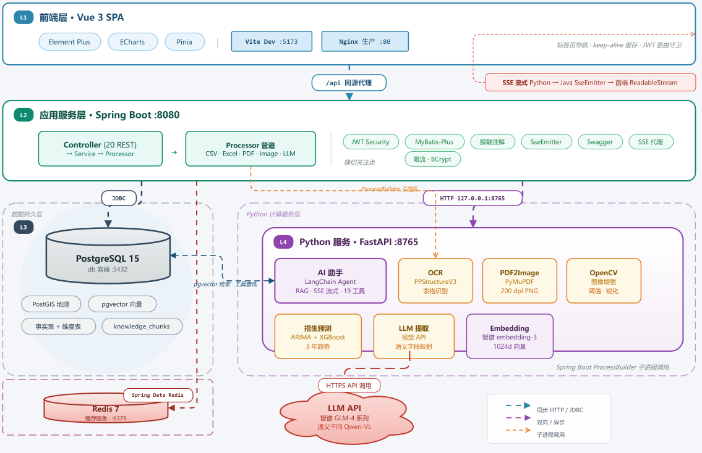
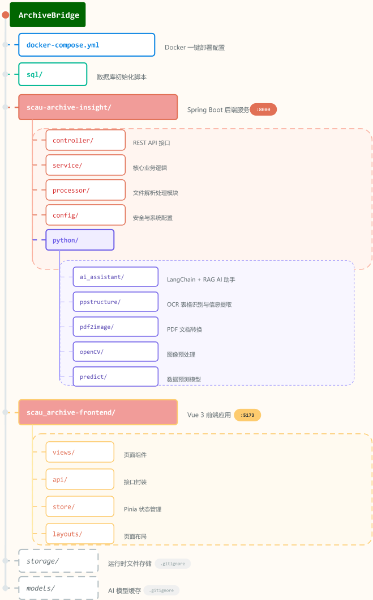

<p align="center">
  
</p>


[](https://github.com/LCJM-85/ArchiveBridge/blob/main/LICENSE)


> **AI-powered archive digitization and intelligent analysis platform**

ArchiveBridge 是一套面向高校招生就业部门的 **AI 驱动档案数字化平台**。

平台结合 **OCR、LLM、多模态理解与数据治理技术**，将招生名册、学籍卡、毕业生登记表等传统纸质档案（蜡纸扫描件、图片、PDF、Excel、CSV）自动转换为结构化数据，并提供数据管理、可视化分析、智能报告与 AI 助手能力。

让传统档案从：

> **人工查阅 → 数字化管理 → 智能分析 → 辅助决策**

实现档案数据价值的进一步释放。

---

##  项目特色

- **AI 驱动的档案数字化流程**
- **OCR 与大模型视觉理解双引擎协同**
- **面向高校业务的数据治理体系**
- **从档案采集到智能决策的完整闭环**

##  项目定位

ArchiveBridge 不只是一个传统档案管理系统，而是一套面向未来高校数字化建设的：

> **智能文档理解与档案知识服务平台**

让长期沉淀的档案数据真正产生价值。

---

## 目录
- [系统架构](#系统架构)
- [快速开始](#快速开始)
- [功能一览](#功能一览)
- [技术栈](#技术栈)
- [项目结构](#项目结构)
- [核心流程](#核心流程)
- [数据库](#数据库)
- [配置](#配置)
- [测试](#测试)
- [常见问题](#常见问题)
- [贡献指南](#贡献指南)
- [许可证](#许可证)

---
## 系统架构

<p align="center">
  
</p>

四项服务通过 `docker-compose.yml` 一键编排（`db` + `backend` + `frontend`）

---

## 快速开始

### 方式一：Docker 一键部署（推荐）

```bash
# 1. 克隆项目
git clone https://github.com/LCJM-85/ArchiveBridge.git
cd ArchiveBridge

# 2. 配置环境变量
cp .env.example .env
# 编辑 .env，填入 GLM_API_KEY=your_api_key（可选，AI 功能需要）
# 填入 DB_PASSWORD（必填！！数据库强密码）

# 3. 启动（首次构建需下载 PaddlePaddle ~1.8GB，约 10-20 分钟）
docker compose up -d

# 4. 打开 http://localhost
# 登录：admin / 123456
```

> 首次启动时，数据库会自动初始化表结构、维度数据及演示业务数据（280 条录取、215 条毕业、280 条学籍），无需手动导入。

### 方式二：本地开发

**1. 数据库**
```bash
# 需要 PostgreSQL 15+ + PostGIS + pgvector(相关编译包已放在后端sql文件夹中)
PGPASSWORD=123456 psql -h localhost -U postgres -f scau-archive-insight/sql/init.sql
```

> 数据库初始化 SQL 文件位于 `sql/` 目录，`init.sql` 为主入口，通过 `\ir` 依次加载 `parts/` 下的表结构、维度数据、地理数据和演示业务数据。

**2. 后端**（端口 8080）
```bash
cd scau-archive-insight
./mvnw spring-boot:run
# API 文档: http://localhost:8080/swagger-ui.html
```

**3. 前端**（端口 5173，新终端）
```bash
cd scau_archive-frontend
npm install
npm run dev
# 访问 http://localhost:5173
```

**4. AI 助手**（端口 8765，可选，需要 AI 对话 & 知识库时启动）
```
# 后端启动会自动拉起AI助手服务
```

> 开发环境前端通过 Vite proxy 将 `/api` 请求转发至 `localhost:8080`，无需额外配置。

### 环境要求（本地开发）

| 组件 | 版本要求 | 说明 |
|------|----------|------|
| JDK | 17 或 21 | 后端运行环境（构建推荐 21） |
| Node.js | 20.19+ 或 22.12+ | 前端构建（Vite 8） |
| PostgreSQL | 15+ | 需启用 PostGIS 与 pgvector 扩展 |
| Python | 3.10+ | 仅 AI 助手 / OCR / 预测脚本需要 |
| Docker | 20.10+ | Docker Compose 部署需要（推荐方式，无需上述本地环境） |

---

## 功能一览

| 模块 | 说明 |
|------|------|
| **档案智能采集** | 蜡纸/扫描件/PDF/Excel/CSV 五类输入，自动 OCR 表格识别与字段映射，可选 LLM 智能提取 |
| **OCR 识别监控** | 实时查看处理进度、质量评分与失败原因，失败文件可重处理 |
| **招生数据管理** | 录取名单查看、筛选、编辑（按学号/身份证/考生号去重） |
| **学籍数据管理** | 在校生学籍信息管理，专业/班级支持自由输入自动建维度 |
| **毕业数据管理** | 毕业生信息、学位、去向管理，自动标记毕业状态 |
| **可视化分析大屏** | 招生趋势、地理热力、学科培养桑基图、AI 招生预测（ARIMA + XGBoost） |
| **智能报告生成** | 一键生成年度招生质量报告（Word + A3 海报），含 AI 智能分析 |
| **AI 助手** | SSE 流式对话，自动检索知识库，支持联网搜索 + 19 种数据库查询 |
| **知识库 (RAG)** | 上传文件（PDF/DOCX/XLSX/TXT）或网页链接，自动分块向量化，增强 AI 回答 |
| **元数据管理** | 自定义字段编码与映射规则 |
| **学院/专业/班级管理** | 系统管理下维护「学院→专业→班级」三级维度挂载，专业可选培养层次，删除带引用保护 |
| **数据脱敏** | 身份证号、姓名等敏感信息一键遮挡，不修改原始数据 |
| **API 文档** | Swagger UI 在线接口文档与调试 |

---

## 技术栈

| 层 | 技术 |
|----|------|
| 后端 | Spring Boot 3.5.13, MyBatis-Plus 3.5.13, PostgreSQL 15 + pgvector + PostGIS, Druid |
| 前端 | Vue 3, Vite 8, Element Plus, ECharts 5, Pinia, Axios |
| Python | FastAPI, LangChain, PaddleOCR 3.5 (PPStructureV3), PaddlePaddle 3.2.2 (CPU), PyMuPDF, OpenCV, Playwright |
| LLM | 智谱 GLM-4-Plus (聊天) / GLM-4V-Plus-0111 (视觉) / embedding-3 (向量), 通义千问 Qwen-VL-Plus |
| AI | SSE 流式对话、RAG 知识库（pgvector 向量检索）、Bing 联网搜索 + Playwright 网页抓取 |
| 预测 | ARIMA + XGBoost 集成预测 |
| 部署 | Docker Compose, Nginx |

---

## 项目结构

<p align="center">
  
</p>
---

## 核心流程

### 文件上传处理

```
上传 → StorageService.saveFiles() → storage/temp/{date}/{type}/
  ├─ CSV/Excel → 字段映射 → 数据校验 → 持久化 → 归档
  ├─ PDF → 转图片 → 逐页 OCR/LLM → 结构化数据 → 持久化 → 归档
  ├─ 图片 → OpenCV 增强 → OCR/LLM → 结构化数据 → 持久化 → 归档
  └─ 失败 → storage/failed/ + .error.json
```

### AI 助手 + 知识库

```
用户提问 → 检索知识库（pgvector 余弦相似度）→ 拼入上下文 → LLM 生成
  ├─ SSE 流式：Python agent.astream_events() → Java SseEmitter → 前端 ReadableStream
  ├─ 工具调用：19 种数据库查询 + Bing 搜索 + Playwright 抓取
  └─ 知识库：上传文件/URL → 解析 → 分块 → 向量化 → 存入 pgvector
```

### 字段匹配

```
fieldName > sourceField > fieldCode
```

OCR 管道：精确 → 去空白 → 包含 → Levenshtein 距离（≤3 字符容差 1，长文本容差 30%）

### 数据去重与口径

- **去重**：录取按 `student_no → id_card → exam_no`，毕业按 `student_no → id_card`，更新已有或插入
- **统计口径**：高考分数统计仅含**学士（本科生）**群体，总录取人数、分布统计**含硕博**，前端已明确标注

---

## 数据库

- **事实表**: `admission_fact`, `student_fact`, `graduation_fact`
- **维度表**: `student_dim`, `province_dim`, `major_dim`, `college_dim`, `degree_dim`, `destination_dim`, `nation_dim`, `political_dim`, `class_dim`, `archive_file_dim`, `ocr_log_dim`, `quality_score_dim`
- **系统表**: `sys_user`, `metadata_standard`
- **知识库表**: `knowledge_base`, `knowledge_chunks`（pgvector 向量字段）

---

## 配置

### LLM 配置

| 变量 | 默认值 | 说明 |
|------|--------|------|
| `GLM_API_KEY` | — | API 密钥（AI 功能必填，可从 [open.bigmodel.cn](https://open.bigmodel.cn/) 获取） |
| `LLM_BASE_URL` | `https://open.bigmodel.cn/api/paas/v4` | API 地址 |
| `LLM_MODEL` | `glm-4v-plus-0111` | 模型名称 |

推荐模型：智谱 GLM-4V-Plus-0111（支持 Base64 图片）、通义千问 Qwen-VL-Plus。

### 数据库 / JWT

| 变量 | 说明 |
|------|------|
| `DB_PASSWORD` | Docker 部署专用数据库密码（必填，取自根目录 `.env`） |
| `DB_PASS` / `DB_HOST` / `DB_PORT` / `DB_NAME` / `DB_USER` | 本地开发数据库连接（`application.yaml` 读取，`DB_PASS` 无默认值） |
| `JWT_SECRET` | JWT 签名密钥，32 位以上（必填，无默认值） |

### 数据脱敏

Header 右上角「脱敏/原始」开关 — 后端 Jackson 注解驱动，不修改数据库原始数据。

---

## 测试

```bash
cd scau-archive-insight

# 运行全部测试
./mvnw test

# 运行单个测试方法
./mvnw test -Dtest=TestClass#method

# 构建（含测试）
./mvnw clean package
```

---

## 常见问题

**Q：Docker 首次构建很慢？**
A：首次需下载 PaddlePaddle CPU 依赖（约 1.8GB），属正常现象。

**Q：AI 助手无响应 / 对话报错？**
A：确认 Python AI 助手服务已启动（8765 端口），且 `.env` 中已配置 `GLM_API_KEY`。

**Q：本地启动后端失败，提示 DB_PASS / JWT_SECRET？**
A：这两个变量无默认值，启动前需导出：
```bash
export DB_PASS=123456 JWT_SECRET=your_strong_secret
```

**Q：OCR 识别精度不理想？**
A：上传前可开启「LLM 智能提取」开关（需配置 LLM API Key）；图片质量差时可先经 OpenCV 增强。

**Q：默认账号是什么？**
A：`admin / 123456`，登录后可在「系统管理 → 用户管理」中修改。

---

## 贡献指南

欢迎提交 Issue 与 Pull Request：

1. Fork 本仓库并创建功能分支（`git checkout -b feature/xxx`）
2. 提交修改（遵循现有代码风格与架构约定：字段匹配优先级、统计口径、处理计数器等）
3. 确保后端测试通过（`./mvnw test`）、前端构建通过（`npm run build`）
4. 发起 Pull Request 至 `main` 分支

---

## 许可证

本项目基于 [MIT License](LICENSE) 开源，详情见 [LICENSE](LICENSE) 文件。
