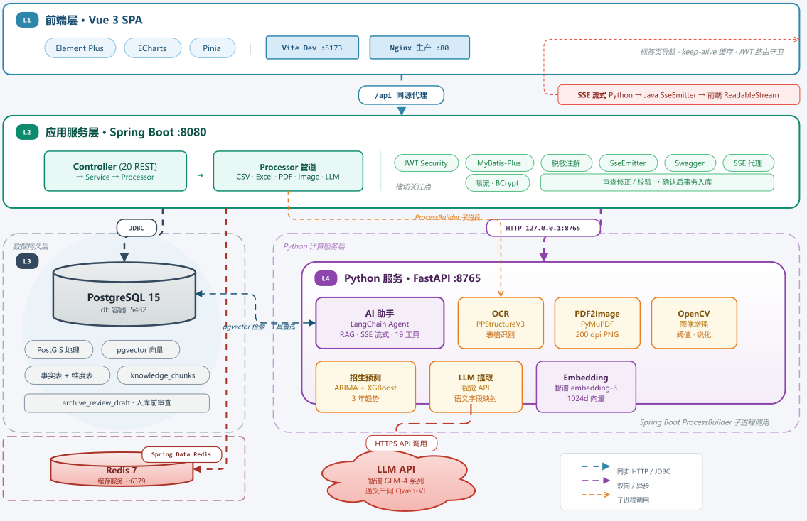
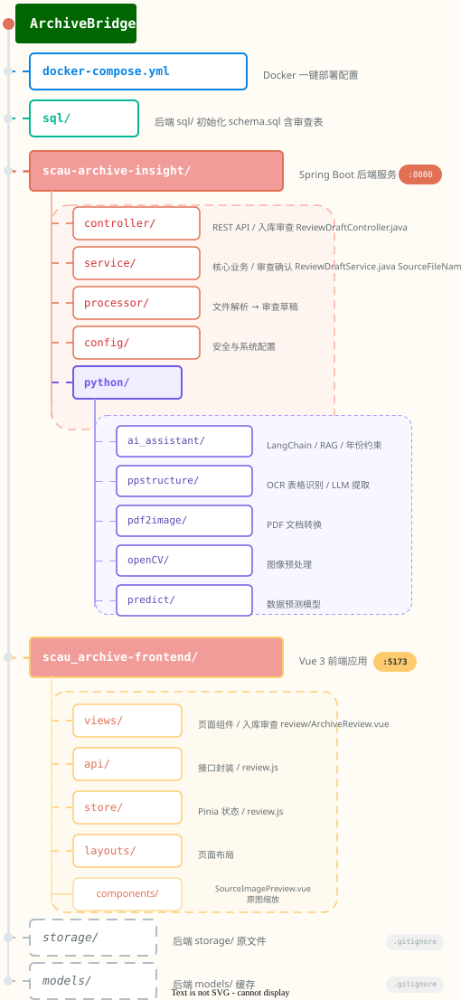

<p align="center">
  
</p>

<div align="center">


[](https://github.com/LCJM-85/ArchiveBridge/blob/main/LICENSE)


 ***University roster archive ingestion and assisted analysis platform***

ArchiveBridge 是一套面向高校招生、学籍与毕业名册的 **档案采集和辅助分析平台**。

平台支持图片、PDF、Excel、CSV等资料导入。对于图片和PDF，操作者可以选择本地OCR或多模态模型处理；所有上传路径解析出的结构化记录先保存为审查草稿，操作者对照原文件修正、增删记录并确认整份文件后，才进入正式数据管理和统计。系统同时提供统计图表、网页报告、知识库问答和趋势预测原型。

</div>

系统处理流程包括：

> **资料导入 → 内容提取 → 入库审查与修正 → 确认入库 → 数据管理与辅助分析**

识别结果和模型输出仍需结合原始资料进行核对。


---

##  项目特色

- **CSV、Excel、图片和PDF等多类资料导入**
- **由操作者选择OCR或多模态模型处理路径**
- **统一入库前审查：对照原文件修正、补充或删除错误识别行**
- **招生、学籍和毕业名册的结构化管理**
- **任务记录、统计图表、知识问答和网页报告**

##  项目定位

ArchiveBridge 的项目范围是：

> **高校名册档案采集、结构化管理与辅助分析**

系统不覆盖档案鉴定、保管期限审批和馆际移交等完整档案管理业务。

---

## 目录
- [系统架构](#系统架构)
- [快速开始](#快速开始)
- [功能一览](#功能一览)
- [技术栈](#技术栈)
- [项目结构](#项目结构)
- [核心流程](#核心流程)
- [数据库](#数据库)
- [配置](#配置)
- [测试](#测试)
- [常见问题](#常见问题)
- [贡献指南](#贡献指南)
- [许可证](#许可证)

---
## 系统架构

<p align="center">
  
</p>

四个服务通过 `docker-compose.yml` 一键编排（`db` + `redis` + `backend` + `frontend`）。Redis 仅保存验证码、限流计数和可重建查询缓存，档案事实数据仍以 PostgreSQL 为准。

---

## 快速开始

### 方式一：Docker 一键部署（推荐）

```bash
# 1. 克隆项目
git clone https://github.com/LCJM-85/ArchiveBridge.git
cd ArchiveBridge

# 2. 配置环境变量
cp .env.example .env
# 编辑 .env，填入 GLM_API_KEY=your_api_key（可选，AI 功能需要）
# 填入 DB_PASSWORD（必填！！数据库强密码）
# 设置 JWT_SECRET（必填，至少 32 字节；替换示例值）
# 建议填入 REDIS_PASSWORD（留空则 Redis 无密码，仅适合受控开发环境）

# 3. 检查配置并构建启动（首次需下载 Python、OCR、Chromium 等依赖）
docker compose config --quiet
docker compose up -d --build

# 4. 打开 http://localhost
# 登录：admin / 12345678
```

> Windows PowerShell 用户将 `cp .env.example .env` 改为 `Copy-Item .env.example .env`，其余 Docker 命令不变。

> 首次启动时，数据库会自动初始化表结构、维度数据及演示业务数据（280 条录取、190 条毕业、280 条学籍），无需手动导入。

> 上述初始化仅在 PostgreSQL 数据卷为空时运行。已有部署更新代码前请执行下文[已有数据库升级](#已有数据库升级)，否则新后端访问 `archive_review_draft` 时会报表不存在。不要为了升级删除数据卷。

> Compose 中的 Redis 和后端 `8080` 均不映射宿主机端口：Redis 仅供后端访问，后端 API 仅通过前端 Nginx 的 `http://localhost` 入口访问。`REDIS_PASSWORD` 会在容器每次启动时应用，并非只在首次初始化时设置。本地 Maven 开发仍可直接使用 `localhost:8080`。

### 方式二：本地开发

**1. 数据库**
```bash
# 需要 PostgreSQL 15+ + PostGIS + pgvector(相关编译包已放在后端sql文件夹中)
PGPASSWORD=123456 psql -h localhost -U postgres -f scau-archive-insight/sql/init.sql
```

PowerShell 写法：

```powershell
$env:PGPASSWORD = "123456"
psql -h localhost -U postgres -f scau-archive-insight/sql/init.sql
```

> 数据库初始化 SQL 文件位于 `scau-archive-insight/sql/` 目录，`init.sql` 为主入口，通过 `\ir` 依次加载 `parts/` 下的表结构、维度数据、地理数据和演示业务数据。

**2. Redis 7**（默认端口 6379）

本机已有 WSL Redis 时可直接使用：

```bash
sudo service redis-server start
redis-cli ping  # 应返回 PONG
```

也可以单独启动一个供本地开发使用的 Redis 容器：

```bash
docker run -d --name scau-redis-dev -p 6379:6379 redis:7-alpine
```

> 本地直启后端默认连接 `localhost:6379`。它与 Compose 内部的 `scau-redis` 是两套独立实例；Compose Redis 未映射端口，不能被本地后端通过 `localhost` 访问。

**3. 后端**（端口 8080）

先创建 Python 虚拟环境、安装依赖并配置 `DB_PASS`、`JWT_SECRET`。本地 Maven 不会自动加载根目录 `.env`；没有 API 密钥时本地 OCR 可以使用，但 AI 对话和 LLM 提取不可用。

```bash
cd scau-archive-insight
python -m venv src/main/python/.venv
```

Windows PowerShell 的 OCR 运行环境二选一安装，只执行匹配环境的一条命令，禁止混装；切换 CPU/GPU 时使用新的虚拟环境：

```powershell
# 通用 CPU 环境
.\src\main\python\.venv\Scripts\python.exe -m pip install -r src\main\python\requirements.txt

# NVIDIA GPU 环境（需匹配的 CUDA/cuDNN）
.\src\main\python\.venv\Scripts\python.exe -m pip install -r src\main\python\requirements-gpu.txt
```

`OCR_DEVICE=auto` 会在运行时检查 GPU、CUDA 和 cuDNN，检查失败则使用 CPU；也可显式设置为 `cpu` 或 `gpu`。该配置不会自动安装或切换 Python 依赖。

安装网页抓取浏览器后启动后端：

```powershell
.\src\main\python\.venv\Scripts\python.exe -m playwright install chromium
.\mvnw.cmd spring-boot:run
# API 文档: http://localhost:8080/swagger-ui.html
```

Wrapper 下载失败时，安装 Maven 3.9+ 后改用 `mvn spring-boot:run`（PowerShell 可用 `mvn.cmd`）。

Linux/macOS 可优先使用 Docker。本地运行时，部分 OCR/预测调用仍使用 `.venv/Scripts/python.exe` 路径，除配置 AI 解释器外还需建立兼容链接；在后端目录、刚创建的虚拟环境中执行：

```bash
src/main/python/.venv/bin/python -m pip install -r src/main/python/requirements.txt
src/main/python/.venv/bin/python -m playwright install --with-deps chromium
mkdir -p src/main/python/.venv/Scripts
ln -s ../bin/python src/main/python/.venv/Scripts/python.exe
export PYTHON_VENV_PATH="$(pwd)/src/main/python/.venv/bin/python"
./mvnw spring-boot:run
```

**4. 前端**（端口 5173，新终端）
```bash
cd scau_archive-frontend
npm install
npm run dev
# 访问 http://localhost:5173
```

**5. AI 助手**（内部端口 8765）
```
# 后端启动自动拉起并监控 AI 助手 Python 服务，不要另外重复启动同一个端口
```

本地修改 Python 脚本或依赖后，应完整重启后端以重新加载 Python 服务；仅刷新浏览器不能生效。Docker 中脚本已复制进镜像，没有源码挂载，需执行 `docker compose up -d --build backend frontend` 重建镜像和容器，单独 `restart` 不会装入宿主机改动。Docker 镜像已安装 Chromium 和所需系统依赖。

> 开发环境前端通过 Vite proxy 将 `/api` 请求转发至 `localhost:8080`，无需额外配置。

### 环境要求（本地开发）

| 组件 | 版本要求 | 说明 |
|------|----------|------|
| JDK | 17 或 21 | 后端运行环境（构建推荐 21） |
| Node.js | 20.19+ 或 22.12+ | 前端构建（Vite 8） |
| PostgreSQL | 15+ | 需启用 PostGIS 与 pgvector 扩展 |
| Redis | 7+ | 验证码、限流与查询缓存；本地默认连接 `localhost:6379` |
| Python | 3.10+ | 仅 AI 助手 / OCR / 预测脚本需要 |
| Docker | 20.10+ | Docker Compose 部署需要（推荐方式，无需上述本地环境） |

---

## 功能一览

| 模块 | 说明 |
|------|------|
| **档案资料采集** | 支持扫描图片、PDF、Excel和CSV；图片与PDF可选择OCR或多模态模型处理 |
| **处理任务查看** | 通过任务列表定时查看处理阶段、文件级质量参考分和失败原因，失败文件可重新处理 |
| **入库审查** | 所有上传解析结果先形成草稿；支持原文件分屏查看、图片滚轮缩放与拖动、编辑/新增/删除行、保存校验及整份文件确认入库 |
| **招生数据管理** | 录取名单查看、筛选、编辑、批量删除（按学号/身份证/考生号匹配更新） |
| **学籍数据管理** | 在校生学籍信息管理，专业/班级支持自由输入自动建维度 |
| **毕业数据管理** | 毕业生信息、学位、去向管理，自动标记毕业状态 |
| **可视化分析大屏** | 展示招生趋势、地理分布和培养层次等统计图表，并提供ARIMA与XGBoost固定加权的趋势预测原型 |
| **网页报告** | 汇总年度招生数据，支持文本模型生成辅助分析，并可通过A3横向打印视图打印或另存为PDF |
| **AI 助手** | 通过SSE传输检索/工具执行状态及完整回答，支持知识库检索、联网搜索和20种数据库查询 |
| **知识库 (RAG)** | 上传文件（PDF/DOCX/XLSX/TXT）或网页链接，自动分块向量化，增强 AI 回答 |
| **元数据管理** | 自定义字段编码与映射规则 |
| **学院/专业/班级管理** | 系统管理下维护「学院→专业→班级」三级维度挂载，专业可选培养层次，删除带引用保护 |
| **数据脱敏** | 身份证号、姓名等敏感信息一键遮挡，不修改原始数据 |
| **认证与查询缓存** | Redis 保存一次性验证码、登录/验证码限流计数，并缓存 Dashboard 与常用维度列表 |
| **API 文档** | Swagger UI 在线接口文档与调试 |

当前上传与入库审查支持招生、毕业两类档案；学籍在数据管理页面维护，不能把三类数据管理理解为三类上传解析均已实现。支持一次选择多个文件，每个文件独立创建处理任务；后端单文件上限为 200MB，单次请求总上限为 500MB。批量上传可能部分成功，需同时检查返回的成功文件和错误信息。

---

## 技术栈

| 层 | 技术 |
|----|------|
| 后端 | Spring Boot 3.5.13, MyBatis-Plus 3.5.13, Druid, Spring Data Redis（Lettuce） |
| 数据 | PostgreSQL 15 + pgvector + PostGIS, Redis 7（临时状态与 Cache-Aside 查询缓存） |
| 前端 | Vue 3, Vite 8, Element Plus, ECharts 6, Pinia, Axios |
| Python | FastAPI, LangChain, PaddleOCR 3.5 (PPStructureV3), PaddlePaddle 3.0.0 (CPU), PyMuPDF, OpenCV, Playwright 1.63 |
| LLM | 默认使用 glm-4-plus（聊天）、glm-4v-plus-0111（视觉）和 embedding-3（向量）；视觉接口可通过环境变量配置兼容服务 |
| AI | SSE事件式响应、RAG知识库（pgvector向量检索）、Bing联网搜索 + Playwright网页抓取 |
| 预测 | ARIMA与XGBoost固定加权的趋势预测原型 |
| 部署 | Docker Compose, Nginx |

---

## 项目结构

<p align="left">
  
</p>

两张图保留原版布局，配套的 `docs/images/*-审查版.xml` 可用 draw.io 编辑；原版 SVG/XML 仍保留。图中的 `sql/`、`storage/`、`models/` 实际位于后端目录下，其中后两项为运行时目录。

---

## 核心流程

### 文件上传处理

```
上传 → StorageService.saveFiles() → storage/temp/{date}/{type}/
  ├─ CSV/Excel → 字段映射 → 审查草稿
  ├─ PDF → 转图片 → 逐页 OCR/LLM → 结构化数据 → 审查草稿
  ├─ 图片（OCR）→ OpenCV 增强（失败时回退原图）→ OCR → 结构化数据 → 审查草稿
  ├─ 图片（LLM）→ 原图直接提取 → 结构化数据 → 审查草稿
  └─ 失败 → storage/failed/ + .error.json

审查草稿 → 对照原文件修正/增删记录 → 保存并校验
  ├─ 确认整份文件 → 事务写入业务记录及正式评分 → 标记已入库 → 原文件归档
  └─ 放弃入库 → 标记已放弃，不写入正式业务记录
```

上传成功只表示后端接收了文件，不表示识别完成或正式入库。解析完成后 OCR 进程显示「待审查」；审查页面默认显示全部状态，草稿状态为 `pending_review`（待审查）、`imported`（已入库）、`discarded`（已放弃）。

审查确认提交全部记录，不仅是当前分页；确认前重新校验，日期无法转换等 `error` 会阻止入库，缺失字段、文件内身份标识重复等 `warning` 提醒可能影响数据。正式统计不包含待审查/已放弃草稿，100 分也不能保证识别内容与原图一致。

数据质量分 = 完整性 50% + 有效性 30% + 一致性 20%，**不是 OCR 识别准确率**。其中 `accuracy` 数据库字段沿用名称但表示规则有效性，`timeliness` 不参与总分。草稿预览只计算评分，确认后才保存正式评分。

业务记录、正式评分和已入库状态在同一数据库事务中提交；原文件移动不属于该事务。若提示「数据已入库，原文件归档失败」，再次确认只补做文件归档，不重复写入业务记录。放弃入库会保留草稿和原文件，便于查看；彻底删除请使用处理记录删除操作。

删除 OCR 处理记录时会提示并同时删除关联审查草稿及对应原文件；已经入库的业务数据不会随处理记录一起删除，应在数据管理页面单独处理。`.tif` 不在上传支持范围内。

### AI 助手 + 知识库

```
用户提问 → 知识检索（前三块 + 相邻段落）→ 按问题类型处理
  ├─ 资料题：模型选择原文 → 程序核对完整引文与来源 → 展示引文或说明无法确认
  ├─ 数据题：本轮工具查询 → 常见人数/分布/状态直接按结果呈现
  ├─ SSE 事件：Python 发送阶段状态和完整回答 → Java SseEmitter → 前端 ReadableStream
  ├─ 工具调用：20 种数据库查询 + Bing 搜索 + Playwright 抓取
  └─ 知识库：上传文件/URL → 解析 → 分块 → 向量化 → 存入 pgvector
```

AI 对话每次使用北京时间的当前日期解释“今年/去年”，明确单年请求的错年份工具调用会被拦截。年份纠正会隔离被质疑的上一轮回答并重新核对；当年无记录不能用旧年份代替。AI 招生年份查询以录取日期为准，不再以文件上传时间补足缺失日期。工具统计仅代表已入库档案，不能据此断言学校现实全量人数、未来预测或档案缺失原因；模型回答仍需核对。

聊天检索保留前三个向量命中，并补充同一资料前后各一个文本块，去重后最多使用12000字符。资料优先问题只展示与检索原文及来源逐字一致的完整引文，核对失败则说明无法确认；这不能保证检索覆盖或回答完整。明确要求联网的问题仍走原工具流程。

需要查库的问题必须取得本轮查询依据；未查询时最多补查询一次，仍无依据则不沿用历史数字。常见人数、专业/省份分布和在籍/毕业状态由工具结果生成，专业缺失归入“未知”。记录存在不等于字段完整或验收完成；复杂分析仍需人工核对。

知识库文件上传分为两步：`POST /api/knowledge/upload/file` 返回不透明的 `fileId`，随后调用 `POST /api/knowledge/upload` 时提交 `fileId` 和 `fileName`。旧版的 `filePath` / `fileType` 请求格式不再适用于对外接口。

### 字段匹配

```
fieldName > sourceField > fieldCode
```

OCR 管道：精确 → 去空白 → 包含 → Levenshtein 距离（≤3 字符容差 1，长文本容差 30%）

### 数据去重与口径

- **去重**：录取按 `student_no → id_card → exam_no`，毕业按 `student_no → id_card`，更新已有或插入
- **统计口径**：高考分数统计仅含**学士（本科生）**群体，总录取人数、分布统计**含硕博**，前端已明确标注

---

## 数据库

- **事实表**: `admission_fact`, `student_fact`, `graduation_fact`
- **维度表**: `student_dim`, `province_dim`, `major_dim`, `college_dim`, `degree_dim`, `destination_dim`, `nation_dim`, `political_dim`, `class_dim`, `archive_file_dim`, `ocr_log_dim`, `quality_score_dim`
- **系统表**: `sys_user`, `metadata_standard`
- **入库审查表**: `archive_review_draft`（原始/修正记录、字段快照、原文件相对路径、状态及版本号；关联 OCR 日志和归档文件）
- **知识库表**: `knowledge_base`, `knowledge_chunks`（pgvector 向量字段）

### 已有数据库升级

新增表和索引已直接维护在 `scau-archive-insight/sql/parts/schema.sql`，没有独立迁移 SQL。新环境仍使用 `init.sql`；已有环境只应用 DDL，**不要重新执行 `init.sql` 或种子/演示数据文件**。本次不修改 `ocr_log_dim` 的表结构，不回迁历史已入库数据。

Docker 部署在项目根目录执行：

```bash
# 先暂停应用，避免配套备份期间继续上传或确认入库；数据库服务保持运行
docker compose stop frontend backend
# 导出数据库和原文件（cp 可以读取已停止的后端容器及其存储卷）
docker compose exec db pg_dump -U postgres -d scau_archive -Fc -f /tmp/archivebridge-before-upgrade.dump
docker compose cp db:/tmp/archivebridge-before-upgrade.dump ./archivebridge-before-upgrade.dump
# 备份目录必须尚不存在；重复备份请换新目录名，以免多套一层 storage
docker compose cp backend:/app/storage ./archivebridge-storage-backup

# 应用当前挂载的表结构（预期旧结构的幂等建表/建索引，不导入业务数据）
docker compose exec db psql -U postgres -d scau_archive -v ON_ERROR_STOP=1 -f /docker-entrypoint-initdb.d/parts/schema.sql
docker compose up -d --build
docker compose ps
docker compose logs --tail=100 backend
```

本地已有数据库也可在备份后使用 `psql -h localhost -U postgres -d scau_archive -v ON_ERROR_STOP=1 -f scau-archive-insight/sql/parts/schema.sql`。若维护 `scau_archive_test`，对该库另执行相同 DDL；`init.sql` 不会自动初始化测试库。

`CREATE TABLE IF NOT EXISTS` 不会修复已存在但字段不完整的审查表；如果曾手工创建过中间版本，需要先对照当前 DDL 检查，不能仅凭建表命令成功认定结构一致。

上面的存储备份通过容器路径读取，不依赖通常带 Compose 项目前缀的实际卷名。迁移目标应先恢复数据库并应用 DDL，再在应用启动前将备份内容恢复到新后端的 `/app/storage`：`docker compose cp ./archivebridge-storage-backup/. backend:/app/storage`。目标容器须已创建，且只能对确认要恢复的目标环境执行；不要将旧备份覆盖到仍在接收上传的环境。

`storage_data` 包含待审查原文件及归档文件，`postgres_data` 包含草稿和业务记录，`paddle_models` 是可重建模型缓存。迁移/恢复不能仅复制数据库，否则「查看原文件」和确认入库可能失败。禁止使用 `docker compose down -v` 作为升级步骤，该操作会删除持久化卷。

---

## 配置

### LLM 配置

| 变量 | 默认值 | 说明 |
|------|--------|------|
| `GLM_API_KEY` | — | API 密钥（AI 功能必填，可从 [open.bigmodel.cn](https://open.bigmodel.cn/) 获取） |
| `LLM_BASE_URL` | `https://open.bigmodel.cn/api/paas/v4` | API 地址 |
| `LLM_MODEL` | `glm-4v-plus-0111` | 仅配置视觉提取模型，不修改 AI 聊天模型 |

当前默认视觉模型为智谱 GLM-4V-Plus-0111（支持Base64图片）；如更换模型，需要同时确认接口兼容性和图片输入格式。

聊天模型当前在 Python 中固定为 `glm-4-plus`，temperature 为 `0.1`；报告分析为 `0.3`。降低 temperature 不能保证事实正确。Agent 依赖使用 `requirements-common.txt` 中已验证的 LangChain 1.x 版本，新部署不要沿用旧的 0.3 虚拟环境。

### 数据库 / JWT

| 变量 | 说明 |
|------|------|
| `DB_PASSWORD` | Docker 部署专用数据库密码（必填，取自根目录 `.env`） |
| `DB_PASS` / `DB_HOST` / `DB_PORT` / `DB_NAME` / `DB_USER` | 本地开发数据库连接（`application.yaml` 读取，`DB_PASS` 无默认值） |
| `JWT_SECRET` | JWT 签名密钥，至少 32 字节；应用本身无默认值，`.env.example` 仅提供演示值，生产部署必须替换 |
| `TRUSTED_PROXY_CIDRS` | 可信反向代理的 IP/CIDR；本地直启应留空，Compose 留空时使用内部私网范围 |
| `PYTHON_VENV_PATH` | AI Python 解释器路径（对应 `python.venv-path`）；Windows 默认使用项目 `.venv/Scripts/python.exe`，Linux/macOS 需显式配置，Compose 已配置容器路径 |

Compose 内置初始化固定使用 `scau_archive`、`postgres`；使用默认内置数据库时保持 `.env.example` 的 `DB_NAME` / `DB_USER`。本地设置系统环境变量后须重开终端/IDE，已有 Java 进程不会自动读取新值。

### Redis

| 变量 | 默认值 | 说明 |
|------|--------|------|
| `REDIS_HOST` | `localhost` | 本地后端连接地址；Compose 会固定为服务名 `redis` |
| `REDIS_PORT` | `6379` | Redis 端口 |
| `REDIS_PASSWORD` | 空 | Redis 密码；Compose 中设置后，Redis 服务与后端会同时使用该密码 |
| `REDIS_DATABASE` | `0` | Redis 逻辑数据库编号 |

验证码有效期为 120 秒；登录失败计数窗口为 10 分钟，达到 8 次后限流；Dashboard 缓存有效期为 5 分钟，维度列表缓存为 30 分钟。缓存采用 Cache-Aside，写操作主动失效，Redis 异常时查询回退 PostgreSQL。

### 数据脱敏

Header 右上角「脱敏/原始」开关 — 后端 Jackson 注解驱动，不修改数据库原始数据。

---

## 测试

```bash
cd scau-archive-insight

# 运行全部测试
./mvnw test

# 运行 Python 回归测试（知识库、AI 事实/年份、部署契约，不由 Maven 执行）
src/main/python/.venv/bin/python -B -m unittest discover -s src/test/python -p "test_*.py"

# 运行真实 Redis 读写测试（需先启动 localhost:6379）
RUN_REDIS_INTEGRATION=true ./mvnw -Dtest=RedisLiveIntegrationTest test

# 运行单个测试方法
./mvnw test -Dtest=TestClass#method

# 构建（含测试）
./mvnw clean package
```

> Windows PowerShell 中将 `./mvnw` 改为 `.\mvnw.cmd`；真实 Redis 测试先执行 `$env:RUN_REDIS_INTEGRATION = "true"`，再运行 `.\mvnw.cmd -Dtest=RedisLiveIntegrationTest test`。

PowerShell 的 Python 测试使用 `.\src\main\python\.venv\Scripts\python.exe -B -m unittest discover -s src/test/python -p 'test_*.py'`。需真实数据库的 Java 测试必须指向独立测试库，不能为跑测试重建业务库；正在运行 DevTools 后端时宜在独立目录编译验证，避免测试编译触发服务重启。

前端回归与构建：在 `scau_archive-frontend` 运行 `node --test tests/*.test.mjs`、`npm ci` 和 `npm run build`。Docker 配置检查在项目根目录运行 `docker compose config --quiet`；实际构建/启动另需运行中的 Docker 引擎，配置检查通过不等于容器启动成功。

AI 年份端到端测试：在后端目录运行虚拟环境中的 Python 执行 `src/test/python/audit_ai_year_context.py`，需配置 `GLM_API_KEY`、会调用真实 AI 接口产生费用；数据库部分使用模拟数据，不发送真实学生资料。`audit_ai_facts.py --direct` 则会发送真实查询结果，仅在获得数据使用授权后运行。

---

## 常见问题

**Q：Docker 首次构建很慢？**
A：首次需下载 OCR/预测依赖、模型和 Chromium，体积与耗时取决于平台和缓存，不能用单一固定大小估计；模型运行缓存使用持久化卷。

**Q：AI 助手无响应 / 对话报错？**
A：确认 Python AI 助手服务已启动（8765 端口），且 `.env` 中已配置 `GLM_API_KEY`。

Docker 通过 Nginx 的 AI SSE 专用配置即时转发事件并将读超时设为 300 秒；不要另起 Python 服务争用 8765。本地启动需在终端/IDE 中配置密钥，根目录 `.env` 不会自动导入。出现新增表不存在时先按「已有数据库升级」执行 DDL，而不是反复重启。

**Q：上传成功了，为什么数据管理里还没有？**
A：先在「OCR 识别进程」确认解析是否完成，再进入「入库审查」修正并确认整份文件。仅保存修正不会正式入库。

**Q：本地启动后端失败，提示 DB_PASS / JWT_SECRET？**
A：应用本身不为这两个变量提供默认值。本地直启前需设置（Compose 会读取根目录 `.env`）：
```bash
export DB_PASS=123456 JWT_SECRET=replace-with-your-own-32-byte-or-longer-secret
```

PowerShell：

```powershell
$env:DB_PASS = "123456"
$env:JWT_SECRET = "replace-with-your-own-32-byte-or-longer-secret"
```

**Q：登录页验证码加载失败或登录返回 503？**
A：验证码采用 Redis fail-closed 策略。请先确认 Redis 已启动，并检查 `REDIS_HOST`、`REDIS_PORT`、`REDIS_PASSWORD` 是否与实际实例一致。Dashboard 等查询缓存故障会自动回退 PostgreSQL，但验证码服务不会绕过校验。

**Q：OCR 识别精度不理想？**
A：上传前可开启「LLM 智能提取」开关（需配置 LLM API Key）；图片质量差时可先经 OpenCV 增强。

**Q：默认账号是什么？**
A：`admin / 12345678`，登录后可在「系统管理 → 用户管理」中修改。

---

## 贡献指南

欢迎提交 Issue 与 Pull Request：

1. Fork 本仓库并创建功能分支（`git checkout -b feature/xxx`）
2. 提交修改（遵循现有代码风格与架构约定：字段匹配优先级、统计口径、处理计数器等）
3. 确保后端测试通过（`./mvnw test`）、前端构建通过（`npm run build`）
4. 发起 Pull Request 至 `main` 分支

---

## 许可证

本项目基于 [MIT License](LICENSE) 开源，详情见 [LICENSE](LICENSE) 文件。
